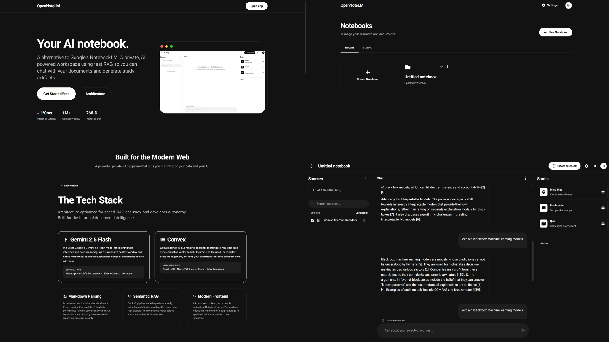

<!-- HERO / Identity Statement -->

  

  

  
  
  
  

---

## Engineering Philosophy

**Production-focused AI/ML engineer bringing elegant systems to life.** 
Bias for clean abstractions, machine intelligence, and shipping things that matter.

> I build at the intersection of machine intelligence and user product. Originally from Hyderabad, India, and now engineering out of San Francisco, CA. My focus spans from raw data science models to autonomous RAG pipelines, data analytics, and reactive full-stack environments.

---

## Systems Metrics

  
  

---

## Systems Design & Evaluation

- **Systems Architecture:** Designing low-latency, scalable infrastructure with zero idle compute overhead.
- **AI/ML Engineering:** Custom RAG pipelines, fine-tuned LLMs, dynamic prompt engineering, and deep learning modeling.
- **Data Engineering:** Extracting, transforming, and interpreting complex, real-world data at scale.
- **Full-Stack Execution:** End-to-end feature ownership from the backend database to the frontend UI.

---

## Technical Core

  
  
  
  
  
  
  
  
  
  
  
  
  
  
  
  
  
  
  
  
  
  

---

## Operational Experience

**Full Stack Developer @ Saayam For All** *(San Jose, CA | July 2025 – Present)*
- Built and maintained backend services and REST APIs in Python using Flask to power real-time geospatial volunteer matching, enabling efficient and low-latency request routing across active users.
- Designed and optimized PostgreSQL schemas on AWS Aurora with spatial indexing to improve nearest neighbor searches and location based filtering.
- Refactored SQL queries and backend workflows to remove performance bottlenecks, improving API stability.
- Integrated AWS services including Lambda, API Gateway, Cognito, and MSK to support a secure microservices architecture.

**Data Analyst @ GRIET** *(Hyderabad, India | 2021 – 2022)*
- Collected, cleaned, and analyzed event participation data using SQL and Excel across more than 12 technical and cultural programs to support planning and improve decision making.
- Built automated dashboards and recurring reports to track engagement trends, reducing manual reporting effort by 50 percent.
- Standardized data preparation, validation, and reporting processes to improve data consistency.
- Led the planning and execution of workshops and hackathons as Chairperson of IEEE GRSS.

---

## Systems Deployed

> From semantic retrieval augmented assistants to scalable data platforms, each project is engineered to withstand real world constraints.

<table>
  <tr>
    <td width="30%">
      
    </td>
    <td width="70%">
      <b><a href="https://github.com/sriramachellu">OpenNoteLM</a> — AI Document Workspace</b> - <a href="https://opennotelm.app">Live</a> 
      A low-latency RAG system integrating Gemini 2.5 Flash and Vertex AI. Features ~120–250ms Time-to-First-Token, robust semantic retrieval, and zero idle compute overhead. Orchestrated via Next.js and Convex.
    </td>
  </tr>
  <tr>
    <td width="30%">
      
    </td>
    <td width="70%">
      <b><a href="https://github.com/sriramachellu/LLM-Powered-Portfolio-Website-with-Interactive-AI-Chat-Custom-RAG-Engine">Apple Liquid-Glass Portfolio</a> — AI Native Web Ecosystem</b> - <a href="https://sriramamurthychellu.dev">Live</a> 
      A fully resilient serverless web application showcasing structured project context via an interactive, AI-driven chatbot. Handles adaptive model fallback with deep Spotify Web API and RAG layer integrations.
    </td>
  </tr>
  <tr>
    <td width="30%">
      
    </td>
    <td width="70%">
      <b><a href="https://github.com/sriramachellu/GenAI-Assisted-Interpretation-of-Metagenomic-Sequencing-Data">Metagenomic Interpretation via GenAI</a> — Clinical Insight Pipelines</b> 
      Transforms raw sequencing noise into PubMed grounded inferences using DeepSeek-R1. Bridges bioinformatics with structural reasoning through strict contaminant filtering and safety constrained generation capabilities.
    </td>
  </tr>
  <tr>
    <td width="30%">
      
    </td>
    <td width="70%">
      <b><a href="https://github.com/sriramachellu/Sales-Performance-Profit-Insights-Analysis-Dashboard-Visualization-SQL-Power-BI-Tableau">Superstore Sales Analysis & Visualization</a> — Retail Analytics Dashboard & ETL Pipeline</b> 
      Developed a scalable data engineering and analytics workflow processing 50,000+ retail records using PySpark and MySQL. Highlights regional performance, profitability trends, and customer retention metrics.
    </td>
  </tr>
  <tr>
    <td width="30%">
      
    </td>
    <td width="70%">
      <b><a href="https://github.com/sri/data-labeler">Autonomous Data Labeler</a> — Active Learning Data Labeling System</b> 
      Architected a weak-to-strong orchestration model where a lightweight model proposes labels, human reviewers validate, and a supervisory model arbitrates. Achieved an 80% reduction in labeling cost.
    </td>
  </tr>
</table>

---

## Core CS

**M.S. in Data Science @ Florida State University** *(Tallahassee, FL | 2023 – 2025)*
- Specialized in advanced ML structures, data mining, and secure data systems. Graduated with honors (3.897 GPA).

**B.Tech. in Electronics and Communication Engineering @ GRIET** *(Hyderabad, India | 2019 – 2023)*
- Studied underlying hardware interfaces alongside higher-level programming logic and algorithms.

---

  

  <b>If you’re working on something ambitious, let’s talk.</b> 
  Always open to designing smarter architectures and driving impact.

  

