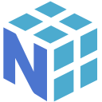

<!-- HERO -->

  

  

  <b>Production focused AI/ML engineer bringing elegant systems to life.</b> 
  Bias for clean abstractions, machine intelligence, and shipping things that matter.

  
  
  
  

---

## Engineering Philosophy

> I build at the intersection of machine intelligence and user product. Originally from Hyderabad, India, and now engineering out of Los Angeles, CA. My focus spans from raw data science models to autonomous RAG pipelines, data analytics, and reactive full stack environments.

- **Systems Architecture:** Designing low-latency, scalable infrastructure with zero idle compute overhead.
- **AI/ML Engineering:** Custom RAG pipelines, fine-tuned LLMs, dynamic prompt engineering, and deep learning modeling.
- **Data Engineering:** Extracting, transforming, and interpreting complex, real world data at scale.
- **Full-Stack Execution:** End-to-end feature ownership from the backend database to the frontend UI.

---

## The Technical Core

> The precise tools, languages, and frameworks powering my production architectures.

   <b>Languages & Core</b>  
  
  
  
  
  
  
    
  <b>Machine Learning & Data Analytics</b>  
  
  
  
  
  
  
  
  
  
  
  
  
  
    
  <b>Generative AI & LLM Systems</b>  
  
  
  
  
  
  
  
  
  
  
  
    
  <b>Cloud, DevOps & Backend</b>  
  
  
  
  
  
  
  
  
  
  
  
  
  
  
    
  <b>AI IDEs, Utilities</b>  
  
  
  
  
  
  
    
  <b>Design Tools</b>  
  
  
  
  

---

## Systems Deployed

> From semantic retrieval augmented assistants to scalable data platforms, each project is engineered to withstand real world constraints.

### [OpenNoteLM](https://github.com/sriramachellu) — *AI Document Workspace* - [Live](https://opennotelm.app)
A low latency RAG system integrating Gemini 2.5 Flash and Vertex AI. Features ~120–250ms Time-to-First-Token, robust semantic retrieval, and zero idle compute overhead. Orchestrated via Next.js and Convex.

### [Apple Liquid-Glass Portfolio](https://github.com/sriramachellu/LLM-Powered-Portfolio-Website-with-Interactive-AI-Chat-Custom-RAG-Engine) — *AI Native Web Ecosystem* - [Live](www.sriramamurthychellu.dev)
A fully resilient serverless web application showcasing structured project context via an interactive, AI-driven chatbot. Handles adaptive model fallback with deep Spotify Web API and RAG layer integrations.

### [Metagenomic Interpretation via GenAI](https://github.com/sriramachellu/GenAI-Assisted-Interpretation-of-Metagenomic-Sequencing-Data) — *Clinical Insight Pipelines*
Transforms raw sequencing noise into PubMed grounded inferences using DeepSeek-R1. Bridges bioinformatics with structural reasoning through strict contaminant filtering and safety constrained generation capabilities.

### [Superstore Sales Analysis & Visualization](https://github.com/sriramachellu/Sales-Performance-Profit-Insights-Analysis-Dashboard-Visualization-SQL-Power-BI-Tableau) — *Retail Analytics Dashboard & ETL Pipeline*
Developed a scalable data engineering and analytics workflow processing 50,000+ retail records using PySpark and MySQL. Highlights regional performance, profitability trends, and customer retention metrics.

---

## Operational Experience

- **Full Stack Developer @ Saayam For All** *(San Jose, CA | July 2025 – Present)*

- **M.S. in Data Science @ Florida State University** *(Tallahassee, FL | 2023 – 2025)*

- **Data Analyst @ GRIET** *(Hyderabad, India | 2021 – 2022)*

- **Bachelor of Technology in Electronics and Communication Engineering @ GRIET** *(Hyderabad, India | 2019 – 2023)*

---

## ✉️ Ready to Scale?

  

  <b>If you’re working on something ambitious, let’s talk.</b> 
  Always open to designing smarter architectures and driving impact.

  

